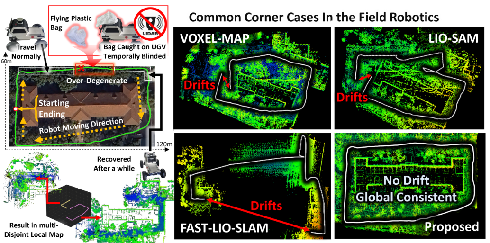
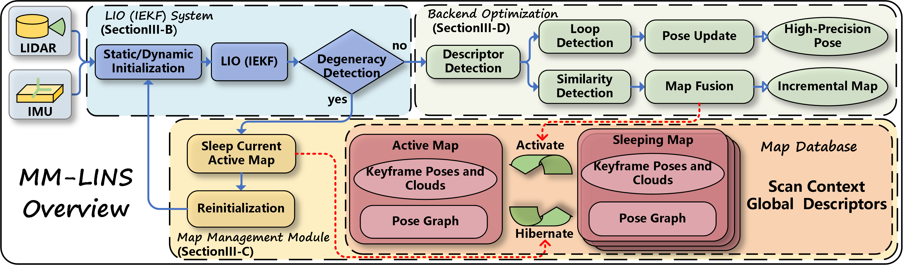

<div align="center">
  <h1>MM-LINS</h1>
  <h2>a Multi-Map LiDAR-Inertial System for Over-Degenerate Environments</h2>
  <p><strong>Official implementation of our paper in <i>IEEE Transactions on Intelligent Vehicles (T-IV), 2024</i></strong></p>
  <br>
  <a href="https://arxiv.org/pdf/2503.19506v1"></a>
  <a href="https://github.com/lian-yue0515/MM-LINS"></a>
  <a href="https://www.bilibili.com/video/BV1eC4y1Z7qk/"></a>
  <a href="https://youtu.be/F3Tsls_ypUU"></a>
</div>

<div align="center">
  
</div>
<div align="center">
  
</div>

## Abstract
SLAM plays a crucial role in automation tasks, such as warehouse logistics, healthcare robotics, and restaurant delivery. These scenes come with various challenges, including navigating around crowds of people, dealing with flying plastic bags that can temporarily blind sensors, and addressing reduced LiDAR density caused by cooking smoke. Such scenarios can result in over-degeneracy, causing the map to drift. To address this issue, this paper presents a multi-map LiDAR-inertial system (MM-LINS). The front-end employs an iterated error state Kalman filter for state estimation and introduces a reliable evaluation strategy for degeneracy detection. If over-degeneracy is detected, the active map will be stored into sleeping maps. Subsequently, the system continuously attempts to construct new maps using a dynamic initialization method. Regarding the back-end, the Scan Context descriptor is utilized to detect inter-map similarity. Upon successful recognition of a sleeping map that shares a common region with the active map, the overlapping trajectory region is utilized to constrain the positional transformation near the edge of the prior map. In response to this, a constraint-enhanced map fusion strategy is proposed to achieve high-precision positional and mapping results. Experiments have been conducted separately on both public datasets that exhibited over-degenerate conditions and in real-world environments. These tests demonstrated the effectiveness of MM-LINS in over-degeneracy environment.

**Contributors**: [Yongxin Ma](https://github.com/lian-yue0515), [Jie Xu](https://github.com/jiejie567), Shenghai Yuan, [Tian Zhi](https://github.com/zht1117), [Wenlu Yu](https://github.com/YWL0720), Jun Zhou, Lihua Xie 

## 1. Prerequisites
### 1.1 Ubuntu and ROS

Ubuntu >= 18.04.

ROS >= Melodic. [ROS](http://wiki.ros.org/ROS/Installation)

### 1.2 PCL && Eigen && gtsam

PCL >= 1.8, Follow [PCL](http://www.pointclouds.org/downloads/linux.html).

Eigen >= 3.3.4, Follow [EIGEN](http://eigen.tuxfamily.org/index.php?title=Main_Page).

gtsam >= 4.0.0, Follow [gtsam](https://gtsam.org/get_started/).

### 1.3 livox_ros_driver

Follow [livox_ros_driver Installation](https://github.com/Livox-SDK/livox_ros_driver).


## 2. Build
Clone the repository and catkin_make:
```
cd ~/catkin_ws/src
git clone https://github.com/lian-yue0515/MM-LINS.git
cd ..
catkin_make
```
## 3. Directly run
```
    # terminal 1: run FAST-LIO2 
    cd ~/catkin_ws/src/MM-LINS/FAST-LIO
    source devel/setup.bash
    roslaunch fast_lio xxx.launch 

    # terminal 2: run SC-PGO
    cd ~/catkin_ws/src/MM-LINS/SC-PGO
    source devel/setup.bash
    roslaunch aloam_velodyne fastlio_ouster64.launch

    # open the other terminal tab: run rosbag
    rosbag play xxx.bag
```
## 4. Rosbag Example
### 4.1 Public Dataset (Degeneracy augmented datasets)
- M2DGR 
- NCLT
- utbm
- UrbanLoco
Download our test bags here: [Baidu](https://pan.baidu.com/s/1uKcH4jxbw3r6VGW6n_9SCQ?pwd=9nf5).
### 4.2 Real-world Field Dataset
- Indoor
- Outdoor 
Download our test bags here: Indoor [Baidu](https://pan.baidu.com/s/1wUiKRWQqie26cNfqIr7kYg?pwd=5gip), Outdoor [geogle](https://drive.google.com/drive/folders/1MWjbV5yU02uH5bu1YwsnymKqK1qrm4kI?usp=sharing).
### 5. Example results 


### Citation
If you use MM-LINS for any academic work, please cite our original [paper](https://ieeexplore.ieee.org/document/10557776)
```
  @ARTICLE{mm-lins,
    author={Ma, Yongxin and Xu, Jie and Yuan, Shenghai and Zhi, Tian and Yu, Wenlu and Zhou, Jun and Xie, Lihua},
    journal={IEEE Transactions on Intelligent Vehicles},
    title={MM-LINS: a Multi-Map LiDAR-Inertial System for Over-Degenerate Environments}, 
    year={2024},
    volume={},
    number={},
    pages={1-11},
    keywords={Simultaneous localization and mapping;Laser radar;Trajectory;Accuracy;Vehicle dynamics;Intelligent vehicles;Sensor phenomena and characterization;Multi-map;over-degenerate;pose graph optimization;simultaneous location and mapping},
    doi={10.1109/TIV.2024.3414852}
  }
```

### Acknowledgements 
- Thanks for [FAST_LIO](https://github.com/hku-mars/FAST_LIO).
- Thanks for Loop detection and Pose-graph Optimization [SC-PGO](https://github.com/gisbi-kim/SC-A-LOAM)
- Thanks for [FAST-LIIO-SLAM](https://github.com/gisbi-kim/FAST_LIO_SLAM).

### License 
The source code is released under [GPLv2](http://www.gnu.org/licenses/) license.

### TODO(s)
* [ ] Example results updating
* [ ] Refinement and updating
* [ ] Waiting for comments on papers

